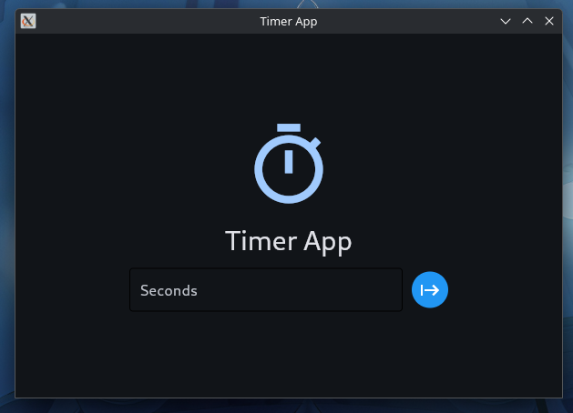

# Timer-App

# 
A time app made with python using Flet (Flutter)
> This app only have Linux  build currently, but on later updates I will add windows build :)

# Building

## 1. Clone the repo:
```
git clone https://github.com/ALPha-web-dev/Timer-App.git
```
## Enter to the directory
```
cd Timer-App
```
## Install flet
```
pip install flet
```
## Start building process
```
flet pack main.py
```
Executable will be in dist folder.
